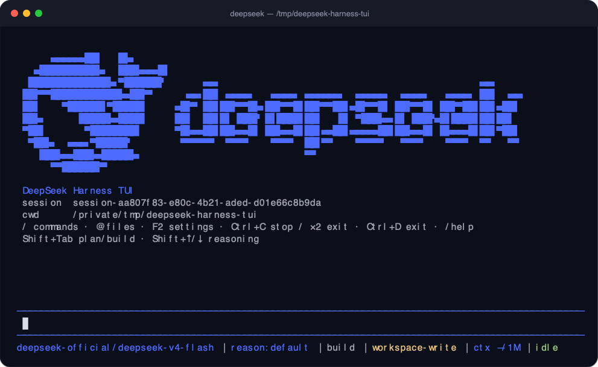

<div align="center">

# DeepSeek Harness TUI

**A focused, terminal-native interface for the official DeepSeek Harness.**

[](https://github.com/DanielOu1208/deepseek-harness-tui/actions/workflows/ci.yml)
[](https://github.com/DanielOu1208/deepseek-harness-tui/actions/workflows/codeql.yml)
[](package.json)
[](LICENSE)



<sub>Actual capture from the compiled TUI using an isolated Harness home. No model request or private session data was used.</sub>

</div>

A standalone terminal UI for the **official [DeepSeek Harness](https://github.com/deepseek-ai/deepseek-harness)**, rendered with [`@earendil-works/pi-tui`](https://www.npmjs.com/package/@earendil-works/pi-tui).

This package does not fork or replace the Harness. The official runtime still owns the agent loop, models, tools, permissions, sessions, checkpoints, compaction, goals, skills, MCP, subagents, profiles, and credentials. This package adds the `deepseek` launcher, a Cordis profile bundle, and the terminal interaction layer.

> **Status:** experimental MVP pinned to DeepSeek Harness `0.1.0-rc.6`. Keep the launcher and profile bundle on matching versions while the Harness is prerelease software.

## Highlights

| | |
|---|---|
| **Official runtime** | Adds a terminal interaction layer without forking the Harness agent loop or persistence model. |
| **Fast controls** | Switch plan/build mode, reasoning effort, transcript detail, and permissions without leaving the composer. |
| **Durable workflows** | Resume, rename, fork, archive, inspect, export, and organize sessions by workspace. |
| **Visible state** | See the active model, reasoning level, permission mode, work status, and approximate context occupancy. |

## Requirements

- Node.js 22.19 or newer
- A DeepSeek API key
- macOS, Linux, or Windows

## Install

One global install supplies the launcher, the matching official Harness `0.1.0-rc.6` runtime, and this TUI bundle:

```sh
npm install --global --install-links github:DanielOu1208/deepseek-harness-tui
```

Keep `--install-links` in the command. For a GitHub source install it makes npm copy the package into the global prefix instead of leaving the launcher linked to npm's temporary checkout.

Confirm the launcher without creating or changing Harness state:

```sh
deepseek --version
deepseek --help
```

The first ordinary `deepseek` launch creates or completes the official `tui` profile under `$DSH_HOME/profiles/tui` (normally `~/.dsh/profiles/tui`) through the official Harness profile APIs. Existing profile files and user patch layers are preserved.

## Authenticate

Store a key with masked terminal input:

```sh
deepseek auth
```

The key is written through the official Harness credential service. It uses `$DSH_HOME/.credentials.yaml` (normally `~/.dsh/.credentials.yaml`), enforces the Harness file-safety rules, and never prints the key.

Check authentication without revealing the credential:

```sh
deepseek auth status
```

Remove a key stored by the Harness:

```sh
deepseek auth logout
```

Logout asks for confirmation and defaults to keeping the credential.

An inherited `DEEPSEEK_API_KEY` takes precedence and is intentionally read-only. When it is present, `auth`, `auth status`, and `auth logout` explain that the environment is supplying the active key. Change or unset it in the shell, service, CI configuration, or other environment that launches `deepseek`; the launcher will not claim to overwrite or remove it.

Keys inherited from project or user `.env` files are also reported with their source. `deepseek auth logout` will not claim to delete those files; remove the key from the reported `.env` source instead.

## Run

```sh
deepseek
deepseek "explain this repository"
deepseek --cwd /path/to/project
deepseek --resume session-xxxxxxxx
```

Arguments are forwarded unchanged to the official Harness `tui` profile. Standard input, standard output, standard error, termination signals, and the Harness exit status are carried through by the launcher.

Inside the TUI:

- Enter submits a prompt.
- Escape closes the current menu or question without stopping the agent.
- Ctrl+C closes an open panel and stops the active turn; press it again to exit.
- Ctrl+D exits when the prompt is empty.
- F2 opens the settings list.
- Shift+Tab switches between plan and build mode. During an active turn, the Harness applies the switch at the next safe model step.
- Shift+Up and Shift+Down raise or lower the reasoning effort for the next model request. The shortcut stops at the highest and lowest advertised levels.
- Ctrl+V attaches a supported image from the system clipboard when the platform provides one; `/attach path` is the portable fallback.
- Up/Down and Enter operate menus; Space toggles checkbox answers.
- `/` opens Harness commands.
- `@` opens file completion.
- Transcript detail defaults to Normal and can be changed from F2 → Transcript detail.

The footer shows approximate context occupancy against the active model's capacity, for example `ctx ~42K/1M (4%)`. The estimate describes the next prompt rather than billing usage and updates immediately after compaction. Before the first provider usage sample, the footer shows the known capacity as `ctx —/1M`.

Unknown slash commands are offered to the official Harness command service. Their availability depends on the composed profile.

Common local commands:

| Command | Purpose |
|---|---|
| `/help` | Show local and official Harness commands |
| `/new` | Start a fresh session |
| `/sessions`, `/resume` | Search sessions by title, ID, or working directory |
| `/resume <session-id>` | Open a known session directly |
| `/session [session-id]` | Rename, fork, or one-way archive a session |
| `/workspaces` | Browse non-archived sessions grouped by workspace |
| `/model`, `/reasoning` | Change the next model request |
| `/permission <mode>` | Set `read-only`, `workspace-write`, or `danger-full-access` tool access |
| `/settings` or F2 | Open the Pi-style settings list |
| `/busy` | Choose queue or steer behavior while an agent is running |
| `/queue [prompt]` | Manage queued work or queue a separate follow-up turn |
| `/steer <prompt>` | Inject guidance at the next safe step of the active turn |
| `/attach [path]` | Manage pending images or attach a PNG, JPEG, GIF, or WebP file |
| `/deliverables` | Browse paths reported by successful mutation tools |
| `/inspect` | Search model steps, tool calls, nested calls, timing, and errors |
| `/stats` | Show whole-session timing and provider token/cache totals |
| `/activity` | Inspect background jobs, workflows, and subagent descendants |
| `/export [markdown\|json]` | Atomically export the current session with recognized image payloads removed |
| `/stop` | Stop the active turn and keep the TUI open |
| `/pause` | Stop, flush, print the resume ID, and exit |
| `/exit` | Flush and exit |

The old singular `/setting` spelling remains accepted for compatibility, but is hidden from completion and help.

The session navigator is sorted by recent activity and includes the current session, persisted non-subagent fork sessions, working directory, and short session ID. `/new` creates an unrelated session; `/session` can create a fork at a completed-turn boundary. Subagent-owned sessions stay out of ordinary navigation and are visible under `/activity`. Switching is blocked while queued messages are waiting, because disposing the active Harness agent would otherwise discard that queued work. If a turn is running without queued work, the TUI asks before stopping it.

Archiving is one-way in Harness `0.1.0-rc.6`: `/session` gives a strong warning and defaults to Cancel. Archived logs remain durable and can be found with `/sessions archived`, but the current runtime exposes no safe unarchive operation.

Bare `/queue` can view pending work, replace text-only items in place, and remove an item that has not been claimed. The runtime does not expose queue reordering, so the TUI does not imitate it with private inbox state.

Text drafts are saved per session under `$DSH_HOME/tui/drafts/v1` using owner-private files and restored during navigation. Pending images are intentionally not persisted. The TUI validates and stores images through the official attachment service, shows `[image]` in terminal history, and does not require terminal-specific inline graphics support.

`/export` flushes the current session before writing an owner-private Markdown or versioned JSON file. Official image attachments, common `image`/`image_url` records, binary values, and `data:image` URLs have their raw or encoded payloads removed while reference metadata is preserved. Plugin event shapes are extensible, so always review an export before sharing it; exports can still contain sensitive prompts, tool output, local paths, and unrecognized plugin-defined data.

`danger-full-access` permits unrestricted tool access. Use it only when the current session and working directory are trusted.

### Transcript detail

The TUI keeps user prompts and assistant answers readable while reducing internal transcript noise:

- **Compact** shows one-line context and tool activity.
- **Normal** adds structured tool outcomes and short previews where useful.
- **Debug** shows bounded reasoning, injected context, tool output, and routine runtime events.

The selected mode is saved globally in the Harness `dsh-tui` settings namespace and applies live. It changes only terminal presentation: model context and durable session events remain unchanged. Debug output still has rendering safety limits; the persisted Harness session remains the authoritative source for larger raw content.

### Runtime and provider settings

F2 includes read-only provider capability and Host plugin summaries. Provider profiles remain in `$DSH_HOME/settings.yaml`; TUI profile composition remains under `$DSH_HOME/profiles/tui`; user agent presets remain under `$DSH_HOME/.agent-presets`. Registered settings namespaces can still be changed from F2 → Advanced runtime settings. Credentials are never displayed; use `deepseek auth status` to inspect their source.

F2 → Support and feedback invokes the official `/feedback` command. Its acknowledgement states whether session sharing is enabled, feedback-gated, disabled, or not configured.

## Update

```sh
npm install --global --install-links github:DanielOu1208/deepseek-harness-tui
deepseek --version
```

The launcher keeps the shipped Harness packages on the matching `0.1.0-rc.6` line. Updating the global package does not erase sessions, credentials, settings, or the user-owned profile patch.

## Uninstall

```sh
npm uninstall --global @chalk/dsh-tui
```

Uninstalling the package leaves Harness user data under `$DSH_HOME` in place. Remove that directory only if you deliberately want to delete credentials, settings, profiles, and sessions too.

## Local development

```sh
git clone https://github.com/DanielOu1208/deepseek-harness-tui.git
cd deepseek-harness-tui
npm install
npm test
npm run build
npm link
deepseek --help
```

To exercise a packed build without touching the real Harness home, point `DSH_HOME` at a temporary directory and invoke the compiled launcher directly.

## Architecture

```text
deepseek launcher
  -> official dsh profile boot (`tui`)
    -> @deepseek-ai/dsh-base
    -> @chalk/dsh-tui
      -> pi-tui terminal interaction
```

The bundle overlay is [`cordis.patch.yml`](cordis.patch.yml). It composes this startup parser and TUI runner over `@deepseek-ai/dsh-base`; it does not copy the Harness runtime into this repository.

The living [Web–TUI capability parity matrix](docs/web-tui-parity.md) records what is supported, intentionally terminal-native, or still planned.

## Troubleshooting

### `deepseek: command not found`

Reinstall with link copying enabled:

```sh
npm install --global --install-links github:DanielOu1208/deepseek-harness-tui
```

Then inspect npm's global prefix:

```sh
npm config get prefix
```

On macOS and Linux, the `bin` directory inside that prefix must be on `PATH`. Start a new shell after changing `PATH`, or run `hash -r` to clear an older command lookup.

### `deepseek auth` says an environment credential is read-only

Run:

```sh
deepseek auth status
```

If it reports `env (read-only)`, unset `DEEPSEEK_API_KEY` in the environment that launches the process. A stored credential cannot override the inherited environment by design.

### Credential file permissions

On POSIX systems, the official provider rejects a credential file readable by group or other users:

```sh
chmod 700 "${DSH_HOME:-$HOME/.dsh}"
chmod 600 "${DSH_HOME:-$HOME/.dsh}/.credentials.yaml"
```

### Inspect the composed profile

The standalone launcher forwards application arguments, while official launcher-level diagnostics remain available through the bundled `dsh` executable. For development inspection:

```sh
deepseek --dump-config
```

The bundle stack should contain `@deepseek-ai/dsh-base` and `@chalk/dsh-tui`.

### Reset only the TUI profile

Move `$DSH_HOME/profiles/tui` aside and run `deepseek` again. The launcher will initialize a clean profile on the next state-changing launch. Credentials and sessions live outside that profile directory.

### Safety notes

- Never put credentials in this repository, prompts, screenshots, issues, or terminal logs.
- `deepseek --help` and `deepseek --version` do not initialize a profile or open credential storage.
- Credential file permissions protect against other OS users, not processes already running as your user.
- Session telemetry remains controlled by the official base profile and is disabled by default unless explicitly enabled.

## Upstream references

- [DeepSeek Harness](https://github.com/deepseek-ai/deepseek-harness)
- [DeepSeek Harness CLI reference](https://github.com/deepseek-ai/deepseek-harness/blob/master/apps/cli/reference/README.md)
- [DeepSeek credential provider](https://github.com/deepseek-ai/deepseek-harness/blob/master/packages/credentials/credentials-local/README.md)

## License

MIT. See [LICENSE](LICENSE) and [THIRD_PARTY_NOTICES.md](THIRD_PARTY_NOTICES.md).
